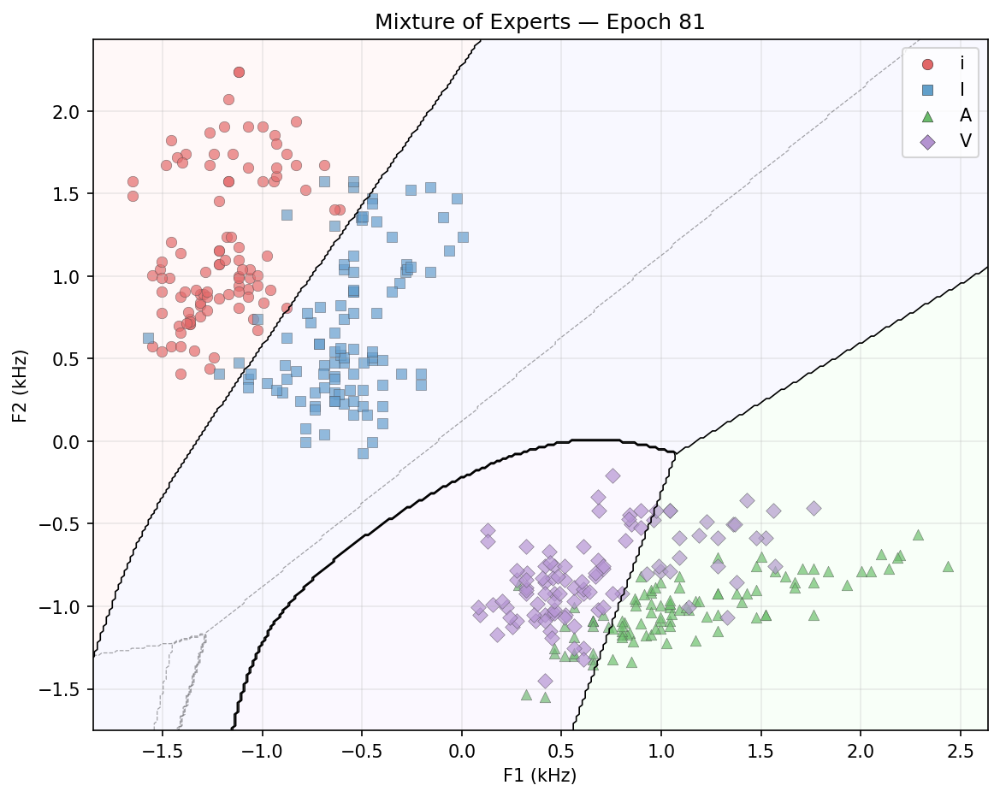
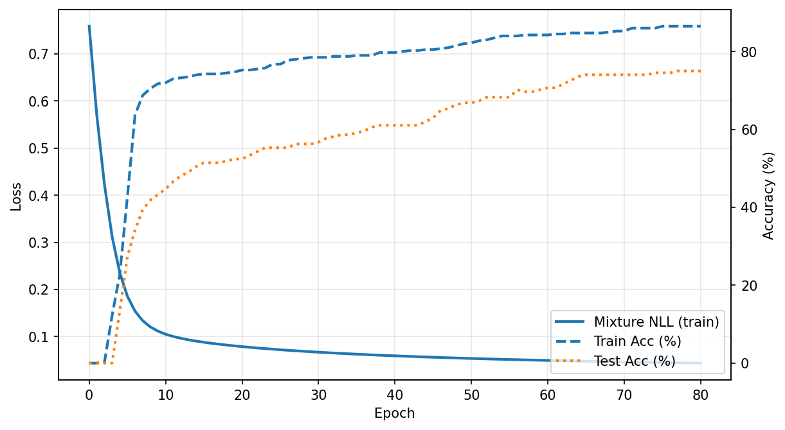

# Adaptive Mixtures of Local Experts

A clean, educational implementation of the foundational *Mixture of Experts* architecture introduced by **Jacobs, Jordan, Nowlan, and Hinton (1991)** rebuilt from first principles in pure NumPy.

This project is designed for anyone who wants to **follow along with the original paper**, understand how expert specialization emerges, and see the learning dynamics unfold visually.  
Each expert learns a simple linear decision boundary, while a gating network learns to route inputs to the most appropriate expert, exactly as described in the 1991 experiments.

You can use this repository to:
- **Reproduce the original results** and decision boundary figures from the paper  
- **Experiment interactively** with learning rates, number of experts, and training criteria  
- **Visualize specialization** as experts take responsibility for different input regions  
- **Learn the math in action** — every part of the implementation corresponds directly to equations in the paper  

**Paper:** [Adaptive Mixtures of Local Experts (1991)](https://www.cs.toronto.edu/~hinton/absps/jjnh91.pdf)

## Quick Start

```bash
# Clone the repo
git clone https://github.com/yourusername/adaptive-mixtures-of-local-experts.git
cd adaptive-mixtures-of-local-experts

# Install dependencies
pip install numpy matplotlib

# Train a mixture of experts on vowel discrimination
python3 train.py --experts 4 --lr 0.002 --tau 0.5

# Or replicate Table 1 from the paper
python3 experiments.py table1 --trials 5
```

## What It Does

The model learns to discriminate between 4 vowel sounds ([i], [ɪ], [a], [ʌ]) based on formant frequencies from 75 speakers. The task naturally divides into two overlapping pairs of vowels, and the experts learn this structure automatically.

### Decision Boundaries

Watch how experts specialize during training:

**Epoch 1** (Random initialization - all experts try everything):


**Epoch 81** (Converged - experts have specialized):


Each expert learns a linear decision boundary. The gating network (dashed lines) routes inputs to the appropriate expert. Notice how Expert 2 (cyan) specializes in the upper vowel pair while Expert 3 (red) handles the lower pair.

### Training Dynamics



The model converges quickly (~81 epochs) reaching:
- **86.5%** train accuracy
- **75.0%** test accuracy
- **Target MSE ≤ 0.08** achieved

## Architecture

```
Input (F1, F2 formants)
    ├─> Expert 1 (Linear classifier)
    ├─> Expert 2 (Linear classifier)  
    ├─> Expert 3 (Linear classifier)
    └─> Expert 4 (Linear classifier)
         ↓
    Gating Network (Softmax)
         ↓
    Weighted Combination → Output
```

Each expert is a simple linear network. The magic is in the **mixture-of-Gaussians objective** (Eq 1.3 in paper):

```
E = -log Σᵢ pᵢ exp(-||d - oᵢ||²/(2σ²))
```

This encourages **competition**: experts with lower error get higher responsibility. Better than standard weighted averaging which encourages cooperation.

## Usage

### Basic Training

```bash
python3 train.py --experts 4 --lr 0.002 --epochs 3000
```

**Arguments:**
- `--experts` - Number of expert networks (default: 4)
- `--lr` - Learning rate (default: 0.002)
- `--epochs` - Max training epochs (default: 10000)
- `--sigma` - Gaussian variance parameter (default: 2.0)
- `--tau` - Gating network temperature (default: 1.0)
- `--target-mse` - Stop when MSE ≤ this (default: 0.08)
- `--out` - Output directory for plots and logs (default: results)
- `--overlay-gate` - Show gating boundaries on decision plots

### Experiments

Replicate Table 1 from the paper (compares MoE vs backprop baselines):

```bash
python3 experiments.py table1 --trials 25 --moe-lr 0.002 --bp-lr 0.05
```

This runs 25 trials each of:
- 4 experts MoE
- 8 experts MoE  
- 6 hidden unit backprop
- 12 hidden unit backprop

Results show MoE converges ~2x faster than backprop with similar accuracy.

### Visualization

```bash
python3 visualize.py
```

## Code Structure

```
moe.py              # Core MoE implementation with mixture-of-Gaussians loss
train.py            # Training pipeline, metrics, visualization
data_loader.py      # Peterson & Barney (1952) vowel dataset loader
evaluate.py         # Confusion matrices and evaluation metrics
experiments.py      # Replicate paper's Table 1 experiments
backprop.py         # Baseline MLP for comparison
visualize.py        # Decision boundary and training curve plots
```

## Key Concepts

### Why Mixture of Experts?

**Problem**: Training one network on multiple subtasks causes interference - the network struggles to specialize.

**Solution**: Train multiple specialized networks (experts) + a gating network that routes inputs:
- Experts can specialize without interference
- Gating network learns task decomposition automatically
- More efficient than one large network

### The Gating Network

Uses softmax to compute mixing proportions `pᵢ` for each expert:

```python
z = x @ W + b
p = softmax(z / tau)  # tau controls sharpness
```

**Temperature `tau`:**
- Low tau (0.5) → sharp gating, faster specialization
- High tau (2.0) → smooth gating, slower but more stable

### Responsibilities

During training, we compute **responsibility** `hᵢ` - the posterior probability that expert `i` should handle this case:

```python
hᵢ = (pᵢ exp(-errorᵢ²)) / Σⱼ(pⱼ exp(-errorⱼ²))
```

Experts with lower error get higher responsibility. This is key to competitive specialization.

## Results

On the 4-class vowel discrimination task (50 speakers train, 25 test):

```
Expert count      : 4
Learning rate     : 0.002
Tau               : 0.5
Sigma             : 2.0
Epochs            : 81
Train Accuracy    : 86.5%
Test Accuracy     : 75.0%
Train MSE         : 0.0799
```

**Expert Specialization** (average responsibility per class):

```
        Expert 0  Expert 1  Expert 2  Expert 3
[i]       0.01      0.02      0.96      0.01
[ɪ]       0.05      0.04      0.80      0.11
[a]       0.04      0.00      0.00      0.95
[ʌ]       0.08      0.01      0.01      0.91
```

Expert 2 handles the upper vowels [i]/[ɪ], Expert 3 handles lower vowels [a]/[ʌ]. Task decomposition emerges automatically!

## Historical Context

This 1991 paper introduced the idea of learning task decomposition through competition. Modern developments:

- **Switch Transformer** (2021): Scaled MoE to 1.6 trillion parameters
- **Mixtral 8x7B** (2023): Open-source sparse MoE matching GPT-3.5
- **GPT-4** (rumored): Uses MoE architecture for efficiency

The core insight remains: specialized experts + learned routing = efficient, interpretable models.

## Dependencies

Minimal on purpose:
```
numpy >= 1.20
matplotlib >= 3.3
```

No PyTorch, no TensorFlow - just NumPy. Makes it easy to understand every line.

## Citation

If you use this code or find it helpful:

```bibtex
@article{jacobs1991adaptive,
  title={Adaptive mixtures of local experts},
  author={Jacobs, Robert A and Jordan, Michael I and Nowlan, Steven J and Hinton, Geoffrey E},
  journal={Neural computation},
  volume={3},
  number={1},
  pages={79--87},
  year={1991},
  publisher={MIT Press}
}
```

## License

MIT - because the best ideas should be free to learn from.

## Acknowledgments

- Original paper by Jacobs, Jordan, Nowlan, and Hinton
- Dataset from Peterson & Barney (1952)

---

**Built for learning.** Fork it, break it, understand it, improve it.
